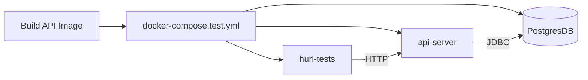

# Comprehensive Testing Strategy

## 1. Frontend Core Logic (Vitest)

- **Mandatory Business Logic Tests:** Any code related to the core business logic (`core/`, `editor/`, data transformations, cursor math) MUST have unit tests in a co-located `*.test.ts` file.
- **Pure Functions:** Core tests must run in isolation without React/DOM dependencies. Each `it()` block creates its own fixtures.

## 2. API Contract & E2E Testing (Hurl + Docker)

Instead of relying on `@SpringBootTest` slices with MockMvc, we use a fully hermetic Docker Compose harness to validate the real built API image via HTTP.

- **No SpringBootTests for Controllers:** Coverage is owned entirely by `hurl` testing the real servlet layer running in Docker.
- **Hermetic Harness:** Tests run inside `docker-compose.test.yml` using `postgres:16`, the real `api-server` image, and the official `hurl` runner.
- **Adding Tests:** Every new controller endpoint or user journey must be covered by a `.hurl` file in `packages/api-server/hurl/`. Tests should cover Happy Path, Validation Failures (400), Auth Guards (401/403), and Domain Errors (404/409).
- **Local Execution:** Run `npm run test:api` to build the test image and execute the test harness locally. Use `npm run test:api:clean` to teardown the harness.
