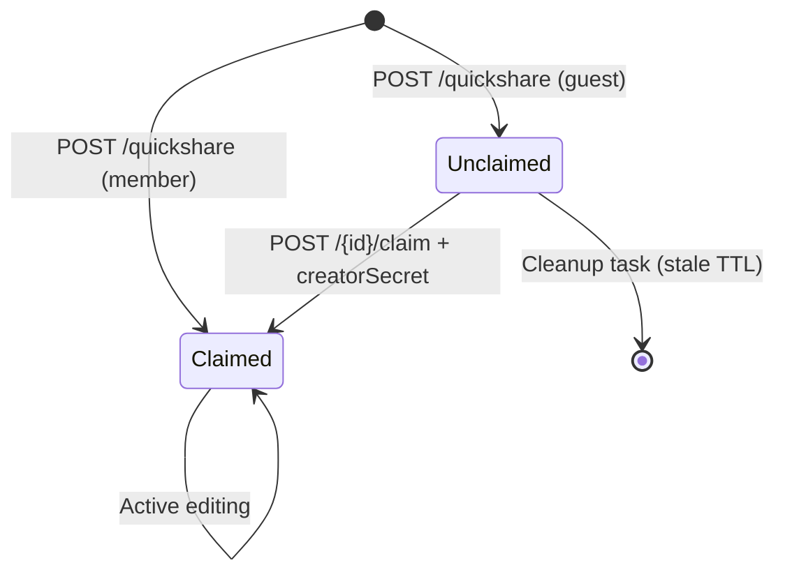

# API Server Reference

> Spring Boot 3 REST API — auth, room management, and Yjs snapshot persistence.

---

## Module Layout

```
com.collab.api
├── auth/
│   ├── AuthController          POST /api/auth/{register,login,guest}
│   ├── AuthService             Business logic: register, login, guest token
│   ├── dto/                    RegisterRequest, LoginRequest, AuthResponse, GuestTokenResponse
│   └── event/                  Post-registration domain events
├── room/
│   ├── RoomController          /api/rooms/** endpoints
│   ├── RoomService             Room creation, claiming, lookup, access control
│   ├── RoomCleanupTask         @Scheduled cleanup of stale unclaimed rooms
│   ├── SlugGenerator           Human-readable slug generation
│   ├── dto/                    RoomResponse, QuickshareResponse, ClaimRequest
│   └── entity/                 Room, RoomMember JPA entities
├── snapshot/
│   ├── SnapshotController      /api/internal/rooms/:id/snapshot (GET, PUT)
│   ├── SnapshotService         Binary snapshot persistence
│   └── entity/                 RoomSnapshot JPA entity
├── user/
│   └── ...                     AppUser entity, repository
└── shared/
    ├── config/                 CORS, WebMvc configuration
    ├── exception/              GlobalExceptionHandler, ApiException
    └── security/
        ├── JwtService          JWT signing/verification (HMAC-SHA)
        ├── JwtAuthenticationFilter   Reads Authorization: Bearer header
        └── InternalApiFilter   Reads x-internal-secret header for /api/internal/**
```

---

## Security

### Two Filter Chains

| Path Pattern | Filter | Auth Mechanism |
|-------------|--------|---------------|
| `/api/internal/**` | `InternalApiFilter` | `x-internal-secret` header → `ROLE_SERVICE` |
| All other `/api/**` | `JwtAuthenticationFilter` | `Authorization: Bearer <jwt>` → `ROLE_GUEST` or `ROLE_AUTHENTICATED` |

### JWT Claims

| Claim | Type | Description |
|-------|------|-------------|
| `sub` | `string` | User UUID (authenticated) or `guest-<uuid>` |
| `role` | `string` | `GUEST` or `AUTHENTICATED` |
| `displayName` | `string?` | Set for authenticated users only |
| `exp` | `number` | Expiry (seconds since epoch) |

---

## Endpoints

### Auth (`/api/auth`)

| Method | Path | Auth | Request | Response | Status |
|--------|------|------|---------|----------|--------|
| `POST` | `/register` | None | `{ email, password, displayName }` | `{ token, userId, displayName }` | `201` |
| `POST` | `/login` | None | `{ email, password }` | `{ token, userId, displayName }` | `200` |
| `POST` | `/guest` | None | — | `{ token, guestId }` | `200` |

### Rooms (`/api/rooms`)

| Method | Path | Auth | Request | Response | Status |
|--------|------|------|---------|----------|--------|
| `POST` | `/quickshare` | Guest or Member | — | `{ id, slug, ownerId, isClaimed, accessMode, creatorSecret }` | `201` |
| `POST` | `/:id/claim` | Member only | `{ creatorSecret }` | `{ id, slug, ownerId, isClaimed, accessMode }` | `200` |
| `GET` | `/` | Member only | — | `RoomResponse[]` | `200` |
| `GET` | `/:id` | Any JWT | — | `RoomResponse` | `200` |
| `GET` | `/by-slug/:slug` | Any JWT | — | `RoomResponse` | `200` |

### Snapshots (`/api/internal/rooms`) — sync-server only

| Method | Path | Auth | Request | Response | Status |
|--------|------|------|---------|----------|--------|
| `PUT` | `/:id/snapshot` | `x-internal-secret` | Binary body (`application/octet-stream`) | — | `200` |
| `GET` | `/:id/snapshot` | `x-internal-secret` | — | Binary body or `204` if none | `200` / `204` |

---

## Room Lifecycle



- **Guest-created rooms** are unclaimed and include a `creatorSecret` in the response.
- **Member-created rooms** are claimed immediately with the caller as owner.
- The `RoomCleanupTask` runs on a schedule to delete stale unclaimed rooms.

---

## Database

PostgreSQL 16. Tables managed by Hibernate/JPA (auto-DDL in dev, migrations in prod).

Key entities:

| Entity | Table | Notes |
|--------|-------|-------|
| `AppUser` | `app_users` | Email, hashed password, display name |
| `Room` | `rooms` | UUID PK, slug, owner FK, access mode, creator secret hash, timestamps |
| `RoomMember` | `room_members` | Join table: user ↔ room with role |
| `RoomSnapshot` | `room_snapshots` | Binary `bytea` column for Yjs state, one row per room |
