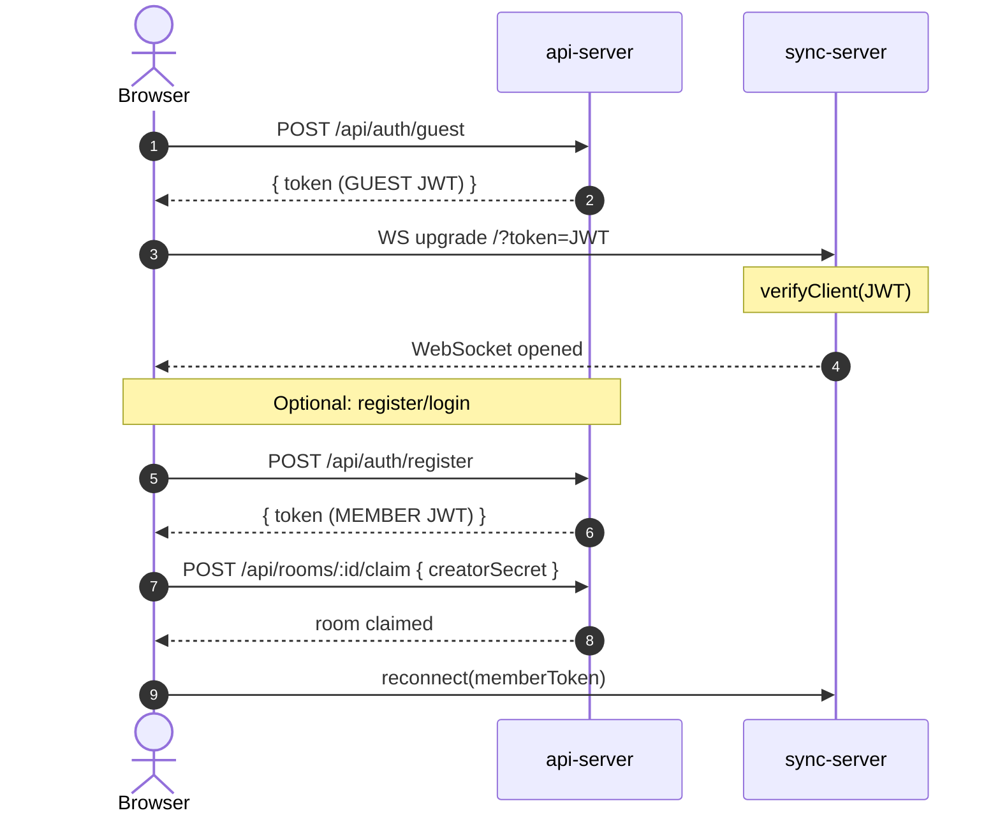

# Architecture

> A from-scratch collaborative text editor built as a monorepo. This document
> describes the current state of the codebase — not a roadmap.

---

## System Overview

```
┌──────────────────────────────────────────────────────────────────────┐
│                           Browser (client)                           │
│                                                                      │
│   ┌──────────┐   ┌──────────────┐   ┌───────────┐   ┌────────────┐   │
│   │   core   │──▶│    editor    │──▶│   view    │──▶│     ui     │   │
│   │ Document │   │ EditorState  │   │ ViewModel │   │ EditorView │   │
│   │ LineIndex│   │   Cursor     │   │           │   │ Components │   │
│   │ Position │   │   History    │   │           │   │            │   │
│   └──────────┘   └──────────────┘   └───────────┘   └────────────┘   │
│        │               │                                             │
│        │  ┌─────────────────────────┐                                │
│        └─▶│    collaboration        │  (only in collab mode)         │
│           │ CollaborativeDocument   │                                │
│           │ YjsUndoManager          │                                │
│           │ awareness               │                                │
│           └─────────┬───────────────┘                                │
│                     │ y-websocket                                    │
└─────────────────────┼────────────────────────────────────────────────┘
                      │ WebSocket (Yjs sync + awareness)
┌─────────────────────▼────────────────────────────────────────────────┐
│                     sync-server (Node.js)                            │
│  • Manages per-room Y.Doc instances                                  │
│  • JWT auth at WebSocket upgrade (verifyClient)                      │
│  • Broadcasts sync & awareness messages between peers                │
│  • Snapshot persistence (debounced saves to api-server)              │
└─────────────────────┬────────────────────────────────────────────────┘
                      │ HTTP (x-internal-secret)
┌─────────────────────▼────────────────────────────────────────────────┐
│                     api-server (Spring Boot)                         │
│  • Auth (register / login / guest tokens)                            │
│  • Room CRUD (quickshare, claim, list, lookup by slug/id)            │
│  • Snapshot persistence (binary Yjs state in PostgreSQL)             │
│  • Scheduled cleanup of stale rooms                                  │
└─────────────────────┬────────────────────────────────────────────────┘
                      │
                 ┌────▼────┐
                 │ Postgres│
                 └─────────┘
```

---

## Package Map

| Package | Path | Stack | Purpose |
|---------|------|-------|---------|
| **client** | `packages/client` | Vite + React + TypeScript | Editor UI and all client-side logic |
| **sync-server** | `packages/sync-server` | Node.js + `ws` + Yjs | WebSocket collaboration relay and snapshot scheduler |
| **api-server** | `packages/api-server` | Spring Boot 3 + PostgreSQL | REST API for auth, rooms, and snapshots |

---

## Client Architecture

### Layer Dependency Rule

```
core ◀── editor ◀── view ◀── ui
                ◀── collaboration (optional)
```

- **core** and **editor** must **never** import from `ui/`.
- **collaboration/** is only wired in when the user enters a room; solo mode works without Yjs.

### Core (`core/`)

Pure data structures and algorithms — zero UI dependencies.

| Module | Responsibility |
|--------|---------------|
| `Position` | Immutable `(line, column)` coordinate |
| `Range` | Ordered pair of `Position`s; auto-normalises on construction |
| `LineIndex` | Maps between byte offsets and `(line, column)` positions |
| `IDocument` | Interface for text storage (read/write + optional remote-change subscription) |
| `Document` | Solo-mode implementation backed by a plain `string` |
| `CollaborativeDocument` | Collab-mode implementation backed by `Y.Text`; fires external listeners on remote changes |

### Editor (`editor/`)

Mutation logic and cursor management.

| Module | Responsibility |
|--------|---------------|
| `Cursor` | Immutable value: anchor + active position. Methods: `moveTo`, `setActive`, `collapseToStart/End`, `toRange` |
| `EditorState` | Central state machine. Accepts `Command`s (`insert_text`, `delete_backward`, `move_cursor`, etc.), delegates to `IDocument`, drives cursor and history. Subscribes to `IDocument` remote-change events to refresh cursor via `Y.RelativePosition`. |
| `IUndoRedoManager` | Interface so `EditorState` can work with either `HistoryManager` (solo) or `YjsUndoManager` (collab). |
| `HistoryManager` | Solo-mode undo/redo stack with consecutive character-insert merging |

### View (`view/`)

Viewport arithmetic — no rendering.

| Module | Responsibility |
|--------|---------------|
| `ViewModel` | Owns scroll position, viewport dimensions, visible-line slice, cursor viewport projection. Converts remote cursors from absolute to viewport-relative coordinates. Manages named top-padding reservations (for remote cursor labels above line 0). |

### UI (`ui/`)

React components that read from `IViewModel` and dispatch `Command`s.

| Module | Responsibility |
|--------|---------------|
| `EditorView` | Main canvas: keyboard handling, mouse-drag selection, auto-scroll, scroll wheel, resize observer. Renders `Line`, `Cursor`, `Selection`, `Gutter`, `Scrollbar`, `RemoteCursor`, `RemoteSelection`. |
| `CollaborationLayout` | Template wrapping `EditorView` with presence bar, connection indicator, and room-claim banner. |
| `SoloLayout` | Minimal wrapper for offline editing. |
| `AuthModal` | Register/login modal for room claiming — uses shadcn `Dialog`, `Input`, `Label`, `Button`. |
| `UserPresenceBar` | Displays connected users with color avatars — uses shadcn `Tooltip`. |

### Design System (`components/`)

Centralized UI primitives powered by **shadcn/ui** (style: `radix-nova`, Tailwind v4 + OKLCH colors).

| Directory | Contents |
|-----------|---------|
| `components/ui/` | shadcn primitives: `Button`, `Input`, `Label`, `Dialog`, `Alert`, `Badge`, `Separator`, `Tooltip`, `Spinner` |
| `components/theme/` | `ThemeProvider` (context + localStorage persistence), `ThemeToggle` (Lucide icon button), `useTheme` hook |

**Component directory rule:** `src/components/ui/` holds shadcn primitives only; `src/ui/components/` holds editor-domain components that depend on `ViewModel`. Never cross-import between these directories.

**Theme system:** `ThemeProvider` wraps the entire app in `App.tsx`. It applies a `dark` or `light` class to `<html>` based on the stored preference (localStorage key `app:theme`), defaulting to `system` (OS preference via `prefers-color-scheme`). The `ThemeToggle` button in `BottomBar` cycles `light → dark → system`. CSS variables for both modes are defined in `src/index.css`.

**CLI:** To add shadcn components — `npx shadcn@latest add <component>` from `packages/client/`. The LLM skill is installed at `packages/client/.agents/skills/shadcn`.

### Collaboration (`collaboration/`)

Yjs-specific adapters — isolated so solo mode has no Yjs dependency at runtime.

| Module | Responsibility |
|--------|---------------|
| `CollaborativeDocument` | `IDocument` backed by `Y.Text`; local mutations tagged `origin: 'local'` so the observer skips re-notifying. |
| `YjsUndoManager` | Wraps `Y.UndoManager` behind `IUndoRedoManager`; tracks only `'local'` origins. |
| `awareness` | Types (`RemoteCursorAbsolute`, `ConnectedUser`, etc.) and the `broadcastCursor` helper that publishes relative positions. |

### Hooks (`hooks/`)

| Hook | Responsibility |
|------|---------------|
| `useCollaborativeEditor` | Bootstraps the full collab session: creates `Y.Doc`, `WebsocketProvider`, `CollaborativeDocument`, `EditorState`, `ViewModel`. Wires awareness (name, color, cursor broadcasting, deduplication by `userId` + `lastActive`). Listens for `MSG_SNAPSHOT_SAVED` to track last saved time. Exposes `reconnect(newToken)` for guest→member upgrade and `lastSaved` for UI. |
| `useSoloEditor` | Creates `Document` → `EditorState` → `ViewModel` with no network. |

---

## Sync Server

Single-file entry point (`src/index.ts`) implementing the Yjs sync and awareness protocols over raw WebSocket.

### Key Behaviours

1. **JWT authentication** — `verifyClient` rejects upgrades without a valid JWT (close code `4401`).
2. **Room lifecycle** — rooms are created lazily on first connection and destroyed when the last client disconnects.
3. **Snapshot hydration** — on room creation, fetches the latest binary snapshot from the api-server and applies it via `Y.applyUpdate`.
4. **Snapshot persistence** — `snapshotScheduler` debounces saves (5 s after last change, ceiling at 60 s). On successful save, it broadcasts a save timestamp (`MSG_SNAPSHOT_SAVED`) to all connected clients. Final save on room teardown.
5. **Awareness cleanup** — tracks each socket's awareness `clientID`s and removes them on disconnect so peers immediately drop stale cursors.

### Internal Modules

| Module | Responsibility |
|--------|---------------|
| `auth/jwtVerifier` | Verifies HMAC-SHA JWT using the shared `JWT_SECRET` (base64-encoded, same key as api-server). |
| `api/snapshotClient` | HTTP client for `GET/PUT /api/internal/rooms/:id/snapshot`. Attaches `x-internal-secret` header. |
| `snapshot/snapshotScheduler` | Debounce + max-wait timer per room. `startTracking` / `stopTracking`. |

---

## Authentication & Identity Flow



**JWT roles**: `GUEST` (anonymous, short-lived) and `AUTHENTICATED` (registered user).

**Room claiming**: guest-created rooms include a `creatorSecret` stored in `localStorage`. Claiming requires presenting this secret + a member JWT.

---

## Data Flow: Editing

### Solo Mode

```
Keyboard event
  → EditorView.handleKeyDown
    → mapKeyboardEvent → Command
      → ViewModel.execute
        → EditorState.execute
          → Document.replace / insert / delete
          → HistoryManager.push
          → Cursor update
          → notifyListeners
            → ViewModel.scrollToCursor + updateView
              → React re-render
```

### Collaborative Mode

```
Local edit:
  EditorState.execute
    → CollaborativeDocument.insert (Y.Text.insert, origin: 'local')
      → Y.Doc update → WebsocketProvider → sync-server → peers

Remote edit:
  sync-server → WebsocketProvider → Y.Doc update
    → Y.Text observer (origin ≠ 'local')
      → CollaborativeDocument external listeners
        → EditorState: restoreCursorFromRelative + notifyListeners
          → React re-render

Cursor sync:
  EditorState.subscribe → broadcastCursor (awareness.setLocalStateField)
  awareness.on('change') → collect remote cursors → ViewModel.setRemoteCursors
```

---

## Deployment

```
GitHub push to main
  → GitHub Actions CI
    → Build 3 Docker images (client, sync-server, api-server)
    → Push to GHCR
    → SSH into VM via Cloudflare Tunnel
    → docker stack deploy (Swarm rolling update)
```

Infrastructure stack: **Nginx** (client container) reverse-proxies `/api` → api-server and `/ws` → sync-server.

### Required Secrets (GitHub Actions)

| Secret | Purpose |
|--------|---------|
| `VITE_WS_URL` | WebSocket URL baked into client at build time |
| `VM_SSH_HOST` | Cloudflare SSH hostname |
| `VM_USER` / `VM_SSH_KEY` | SSH credentials for deployment |
| `APP_JWT_SECRET` | Shared HMAC key (api-server + sync-server) |
| `APP_INTERNAL_API_SECRET` | Shared secret for internal snapshot API |
