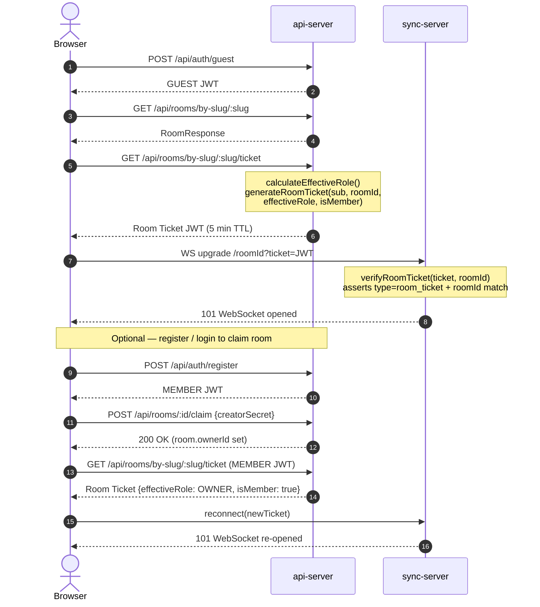
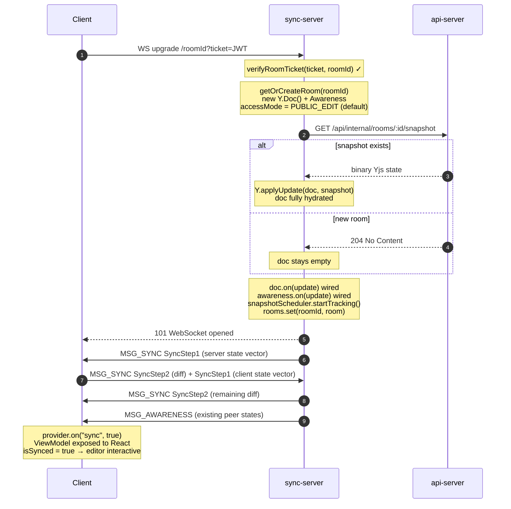
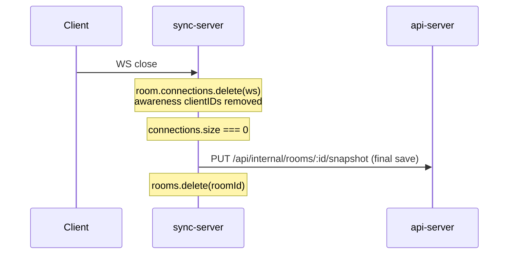
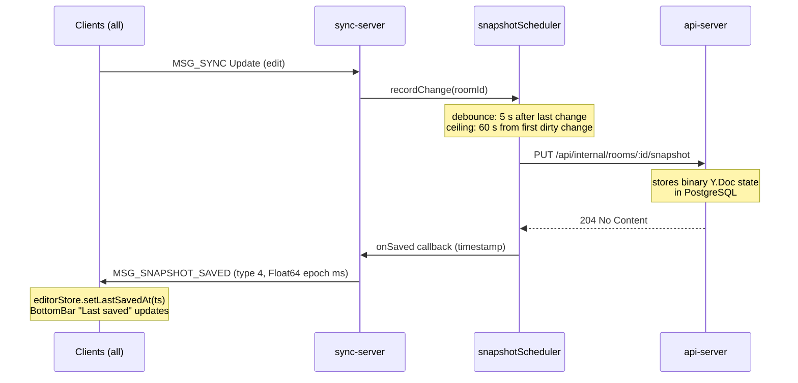
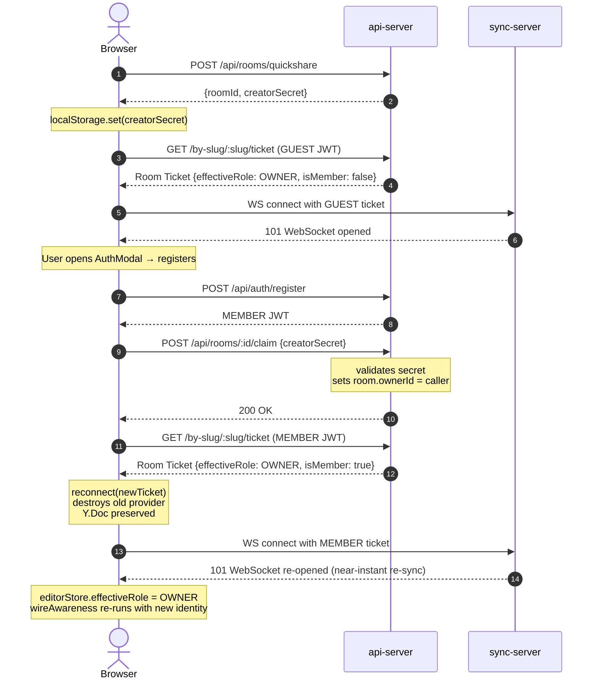
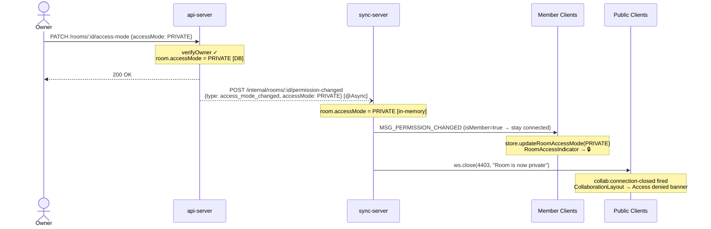
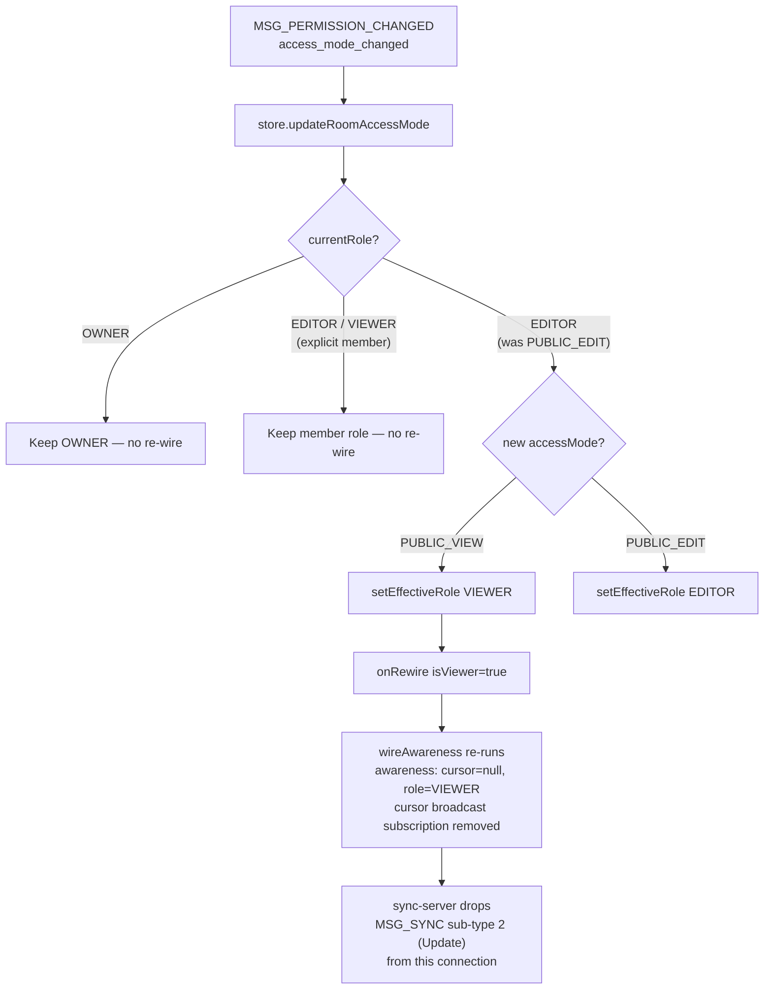
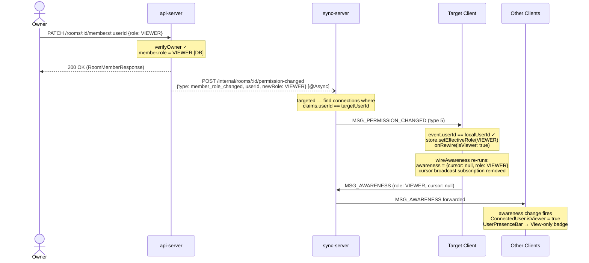
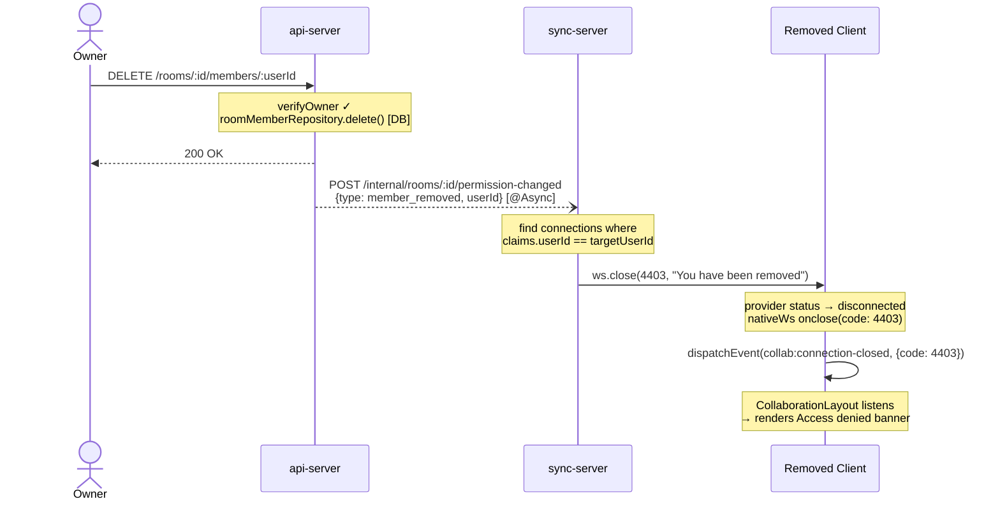
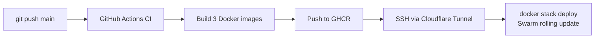

# Architecture

> A from-scratch collaborative text editor built as a monorepo. This document
> describes the current state of the codebase — not a roadmap.

---

## System Overview

```
┌──────────────────────────────────────────────────────────────────────┐
│                           Browser (client)                           │
│                                                                      │
│   ┌──────────┐   ┌──────────────┐   ┌───────────┐   ┌────────────┐   │
│   │   core   │──▶│    editor    │──▶│   view    │──▶│     ui     │   │
│   │ Document │   │ EditorState  │   │ ViewModel │   │ EditorView │   │
│   │ LineIndex│   │   Cursor     │   │           │   │ Components │   │
│   │ Position │   │   History    │   │           │   │            │   │
│   └──────────┘   └──────────────┘   └───────────┘   └────────────┘   │
│        │               │                                             │
│        │  ┌─────────────────────────┐                                │
│        └─▶│    collaboration        │  (only in collab mode)         │
│           │ CollaborativeDocument   │                                │
│           │ YjsUndoManager          │                                │
│           │ awareness               │                                │
│           └─────────┬───────────────┘                                │
│                     │ y-websocket                                    │
└─────────────────────┼────────────────────────────────────────────────┘
                      │ WebSocket (Yjs sync + awareness)
┌─────────────────────▼───────────────────────────────────────────────┐
│                     sync-server (Node.js)                           │
│  • Manages per-room Y.Doc instances                                 │
│  • Room Ticket JWT auth at WebSocket upgrade (verifyClient)         │
│  • Broadcasts sync & awareness messages between peers               │
│  • Snapshot persistence (debounced saves to api-server)             │
│  • Real-time permission fan-out (MSG_PERMISSION_CHANGED)            │
│  • Write-blocking for VIEWER role on every incoming Update msg      │
└─────────────────────┬───────────────────────────────────────────────┘
                      │ HTTP (x-internal-secret)
┌─────────────────────▼───────────────────────────────────────────────┐
│                     api-server (Spring Boot)                        │
│  • Auth (register / login / guest tokens)                           │
│  • Room CRUD (quickshare, claim, list, lookup by slug/id)           │
│  • Room Ticket issuance (GET /api/rooms/by-slug/:slug/ticket)       │
│  • Permission management (access mode, member CRUD)                 │
│  • Snapshot persistence (binary Yjs state in PostgreSQL)            │
│  • Async sync-server notification (SyncServerNotifier)              │
│  • Scheduled cleanup of stale rooms                                 │
└─────────────────────┬───────────────────────────────────────────────┘
                      │
                 ┌────▼────┐
                 │ Postgres│
                 └─────────┘
```

---

## Package Map

| Package | Path | Stack | Purpose |
|---------|------|-------|---------|
| **client** | `packages/client` | Vite + React + TypeScript | Editor UI and all client-side logic |
| **sync-server** | `packages/sync-server` | Node.js + `ws` + Yjs | WebSocket collaboration relay and snapshot scheduler |
| **api-server** | `packages/api-server` | Spring Boot 3 + PostgreSQL | REST API for auth, rooms, permissions, and snapshots |

---

## Client Architecture

### Layer Dependency Rule

```
core ◀── editor ◀── view ◀── ui
                ◀── collaboration (optional)
```

- **core** and **editor** must **never** import from `ui/`.
- **collaboration/** is only wired in when the user enters a room; solo mode works without Yjs.

### Core (`core/`)

Pure data structures and algorithms — zero UI dependencies.

| Module | Responsibility |
|--------|---------------|
| `Position` | Immutable `(line, column)` coordinate |
| `Range` | Ordered pair of `Position`s; auto-normalises on construction |
| `LineIndex` | Maps between byte offsets and `(line, column)` positions |
| `IDocument` | Interface for text storage (read/write + optional remote-change subscription) |
| `Document` | Solo-mode implementation backed by a plain `string` |
| `CollaborativeDocument` | Collab-mode implementation backed by `Y.Text`; fires external listeners on remote changes |

### Editor (`editor/`)

Mutation logic and cursor management.

| Module | Responsibility |
|--------|---------------|
| `Cursor` | Immutable value: anchor + active position. Methods: `moveTo`, `setActive`, `collapseToStart/End`, `toRange` |
| `EditorState` | Central state machine. Accepts `Command`s (`insert_text`, `delete_backward`, `move_cursor`, etc.), delegates to `IDocument`, drives cursor and history. Subscribes to `IDocument` remote-change events to refresh cursor via `Y.RelativePosition`. |
| `IUndoRedoManager` | Interface so `EditorState` can work with either `HistoryManager` (solo) or `YjsUndoManager` (collab). |
| `HistoryManager` | Solo-mode undo/redo stack with consecutive character-insert merging |

### View (`view/`)

Viewport arithmetic — no rendering.

| Module | Responsibility |
|--------|---------------|
| `ViewModel` | Owns scroll position, viewport dimensions, visible-line slice, cursor viewport projection. Converts remote cursors from absolute to viewport-relative coordinates. Manages named top-padding reservations (for remote cursor labels above line 0). |

### UI (`ui/`)

React components that read from `IViewModel` and dispatch `Command`s.

| Module | Responsibility |
|--------|---------------|
| `EditorView` | Main canvas: keyboard handling, mouse-drag selection, auto-scroll, scroll wheel, resize observer. Renders `Line`, `Cursor`, `Selection`, `Gutter`, `Scrollbar`, `RemoteCursor`, `RemoteSelection`. Keyboard and mouse handlers are disabled when `effectiveRole === "VIEWER"`. |
| `CollaborationLayout` | Template wrapping `EditorView` with presence bar, connection indicator, and room-claim banner. Listens for `collab:connection-closed` DOM event to detect close code `4403` and render an access-denied banner. |
| `SoloLayout` | Minimal wrapper for offline editing. |
| `AuthModal` | Register/login modal for room claiming — uses shadcn `Dialog`, `Input`, `Label`, `Button`. |
| `UserPresenceBar` | Displays connected users with color avatars — uses shadcn `Tooltip`. Renders a "View-only" badge for users whose awareness state carries `role: "VIEWER"`. |
| `ShareModal` | Owner-only dialog for managing room access. Allows changing `accessMode` (PRIVATE / PUBLIC_VIEW / PUBLIC_EDIT) and managing explicit member list (add by email, change role, remove). All mutations trigger async sync-server notifications via the api-server. |
| `RoomAccessIndicator` | Bottom bar indicator showing the room's current access mode. Clickable for OWNER role to open `ShareModal`; read-only display for all others. |

### Design System (`components/`)

Centralized UI primitives powered by **shadcn/ui** (style: `radix-nova`, Tailwind v4 + OKLCH colors).

| Directory | Contents |
|-----------|---------|
| `components/ui/` | shadcn primitives: `Button`, `Input`, `Label`, `Dialog`, `Alert`, `Badge`, `Separator`, `Tooltip`, `Spinner`, `Select` |
| `components/theme/` | `ThemeProvider` (context + localStorage persistence), `ThemeToggle` (Lucide icon button), `useTheme` hook |

**Component directory rule:** `src/components/ui/` holds shadcn primitives only; `src/ui/components/` holds editor-domain components that depend on `ViewModel`. Never cross-import between these directories.

**Theme system:** `ThemeProvider` wraps the entire app in `App.tsx`. It applies a `dark` or `light` class to `<html>` based on the stored preference (localStorage key `app:theme`), defaulting to `system` (OS preference via `prefers-color-scheme`). The `ThemeToggle` button in `BottomBar` cycles `light → dark → system`. CSS variables for both modes are defined in `src/index.css`.

**CLI:** To add shadcn components — `npx shadcn@latest add <component>` from `packages/client/`. The LLM skill is installed at `packages/client/.agents/skills/shadcn`.

### Collaboration (`collaboration/`)

Yjs-specific adapters — isolated so solo mode has no Yjs dependency at runtime.

| Module | Responsibility |
|--------|---------------|
| `CollaborativeDocument` | `IDocument` backed by `Y.Text`; local mutations tagged `origin: 'local'` so the observer skips re-notifying. |
| `YjsUndoManager` | Wraps `Y.UndoManager` behind `IUndoRedoManager`; tracks only `'local'` origins. |
| `awareness` | Types (`RemoteCursorAbsolute`, `ConnectedUser`, etc.) and the `broadcastCursor` helper that publishes relative positions. |

### Zustand Store (`store/editorStore`)

Global client-side state shared between the editor hook and bottom-bar UI components.

| Field | Type | Purpose |
|-------|------|---------|
| `cursorPosition` | `{line, column} \| null` | Active cursor location shown in `BottomBar` |
| `selectionCount` | `number` | Selected-character count shown in `BottomBar` |
| `lastSavedAt` | `number \| null` | Epoch ms of last successful snapshot save (set by `MSG_SNAPSHOT_SAVED` handler) |
| `effectiveRole` | `string \| null` | The local user's computed role (`OWNER`, `EDITOR`, `VIEWER`) — decoded from the Room Ticket JWT at connect time; updated in-place by `MSG_PERMISSION_CHANGED` events |
| `room` | `RoomResponse \| null` | Full room metadata; `accessMode` field is patched in-place by `updateRoomAccessMode` |

### Hooks (`hooks/`)

| Hook | Responsibility |
|------|---------------|
| `useCollaborativeEditor` | Bootstraps the full collab session: creates `Y.Doc`, `WebsocketProvider`, `CollaborativeDocument`, `EditorState`, `ViewModel`. Decodes `effectiveRole` from the Room Ticket JWT and stores it in the editor store. Gates `ViewModel` exposure until the initial Yjs sync handshake completes (`provider.on("sync")`). Wires awareness (name, color, cursor broadcasting, deduplication by `userId` + `lastActive`). Listens for `MSG_SNAPSHOT_SAVED` to track last saved time. Listens for `MSG_PERMISSION_CHANGED` to update `effectiveRole` and `room.accessMode` in the store, re-wiring awareness in-place without a reconnect. Dispatches `collab:connection-closed` DOM events so `CollaborationLayout` can detect close code `4403` and show the access-denied banner. Exposes `reconnect(newTicket)` for guest→member upgrade. |
| `useSoloEditor` | Creates `Document` → `EditorState` → `ViewModel` with no network. |

---

## Sync Server

Split into two listeners:

- **WebSocket server** (`ws.WebSocketServer`) on `PORT` (default `1234`) — Yjs sync + awareness.
- **Internal HTTP server** (`http.createServer`) on `PORT + 1` (default `1235`) — api-server → sync-server permission notifications.

### Key Behaviours

1. **Room Ticket authentication** — `verifyClient` calls `verifyRoomTicket(ticket, roomId)` which validates the JWT signature, asserts `type === "room_ticket"`, and asserts the embedded `roomId` claim matches the requested WebSocket path. Rejects upgrades with HTTP 401 on failure.
2. **Room lifecycle** — rooms are created lazily on first connection (see [Room Initialization](#room-initialization-hydration)) and destroyed when the last client disconnects.
3. **Snapshot hydration** — on room creation, fetches the latest binary snapshot from the api-server and applies it via `Y.applyUpdate` before the first client receives a `SyncStep1`. See [Room Initialization flow](#room-initialization-hydration).
4. **Snapshot persistence** — `snapshotScheduler` debounces saves (5 s after last change, ceiling at 60 s). On successful save, broadcasts a save timestamp (`MSG_SNAPSHOT_SAVED`) to all connected clients. Final save on room teardown.
5. **VIEWER write-blocking** — the message handler inspects `claims.effectiveRole` on every `MSG_SYNC` message. Sub-type `2` (Update) from a VIEWER is silently dropped (connection stays open). Sub-types `0` and `1` (SyncStep1/2 handshake) are always allowed through so the handshake completes.
6. **Awareness passthrough for VIEWERs** — awareness updates from VIEWERs are forwarded to peers so they appear in the presence bar. The client-side hook guarantees VIEWERs only publish identity fields (`user`, `userId`, `lastActive`, `role: "VIEWER"`) and never publish cursor positions.
7. **Real-time permission reactivity** — the internal HTTP server accepts `POST /internal/rooms/:id/permission-changed` events from the api-server. See [Permission Changed flow](#permission-changed).

### Room State

Each in-memory `Room` carries an `accessMode` string (default `"PUBLIC_EDIT"`) updated in real time by the permission handler. The sync message handler reads `room.accessMode` dynamically on every incoming `Update` message — so existing connections are write-blocked immediately when the owner changes the mode to `PUBLIC_VIEW`, without requiring a reconnect.

Each `WebSocket` is keyed in `connectionClaims: WeakMap<WebSocket, TicketClaims>` where `TicketClaims = { userId, effectiveRole, isMember }`. `isMember` is embedded by the api-server at ticket issuance time and used to decide which connections survive a transition to `PRIVATE` access mode.

### Custom WebSocket Message Types

| Type | Constant | Direction | Payload |
|------|----------|-----------|---------|
| 0 | `MSG_SYNC` | bidirectional | y-protocols sync frames |
| 1 | `MSG_AWARENESS` | bidirectional | y-protocols awareness updates |
| 4 | `MSG_SNAPSHOT_SAVED` | server → client | Float64 save timestamp |
| 5 | `MSG_PERMISSION_CHANGED` | server → client | VarString JSON `PermissionEvent` |

### Internal Modules

| Module | Responsibility |
|--------|---------------|
| `auth/jwtVerifier` | Verifies HMAC-SHA JWT using the shared `JWT_SECRET` (base64-encoded, same key as api-server). Exports `verifyToken` (general JWT) and `verifyRoomTicket` (room-scoped ticket with `roomId` + `effectiveRole` + `isMember` claims). |
| `api/snapshotClient` | HTTP client for `GET/PUT /api/internal/rooms/:id/snapshot`. Attaches `x-internal-secret` header. |
| `api/permissionHandler` | Internal HTTP endpoint handler. Parses `PermissionEvent` JSON, fans out `MSG_PERMISSION_CHANGED` binary messages, closes `4403` connections. Exports `handlePermissionEvent` and `createInternalHttpHandler`. |
| `snapshot/snapshotScheduler` | Debounce + max-wait timer per room. `startTracking` / `stopTracking`. |

---

## API Server — Permission Model

### Roles

| Role | Source | Write? | Notes |
|------|--------|--------|-------|
| `OWNER` | Explicit: room creator or `room_members.role = OWNER` | ✅ | Can manage all permissions |
| `EDITOR` | Explicit `room_members.role = EDITOR` **or** `accessMode = PUBLIC_EDIT` (public) | ✅ | Cannot manage permissions |
| `VIEWER` | Explicit `room_members.role = VIEWER` **or** `accessMode = PUBLIC_VIEW` (public) | ❌ | Read-only; blocked at sync-server |

### Access Modes

| `accessMode` | Non-member access | Explicit member access |
|-------------|------------------|----------------------|
| `PRIVATE` | Forbidden (403) | Role from `room_members` |
| `PUBLIC_VIEW` | `VIEWER` | Role from `room_members` |
| `PUBLIC_EDIT` | `EDITOR` | Role from `room_members` |

`calculateEffectiveRole` (in `RoomService`) resolves the caller's effective role in priority order:

1. If the caller is the `room.ownerId` → `OWNER`
2. If there is a `room_members` row for the caller → that row's role
3. Else fall through to `accessMode` → `EDITOR`, `VIEWER`, or `403 FORBIDDEN`

### Permission API Endpoints

All permission endpoints require `hasRole('AUTHENTICATED')`.

| Method | Path | Guard | Effect |
|--------|------|-------|--------|
| `GET` | `/api/rooms/by-slug/:slug/ticket` | Any auth | Issues a short-lived (5 min) Room Ticket JWT embedding `effectiveRole` + `isMember` |
| `PATCH` | `/api/rooms/:id/access-mode` | OWNER only | Updates `accessMode`; triggers async `notifyAccessModeChanged` |
| `GET` | `/api/rooms/:id/members` | OWNER only | Lists all `room_members` with user details |
| `POST` | `/api/rooms/:id/members` | OWNER only | Adds a user (by email) with a specified role; triggers nothing (new connection picks up role from DB) |
| `PATCH` | `/api/rooms/:id/members/:userId` | OWNER only | Updates a member's role; triggers async `notifyMemberRoleChanged` |
| `DELETE` | `/api/rooms/:id/members/:userId` | OWNER only | Removes a member; triggers async `notifyMemberRemoved` |

### SyncServerNotifier

A Spring `@Service` that fire-and-forget POSTs to the sync-server's internal HTTP listener after each permission mutation. All methods are `@Async` so the main API response returns immediately. A network failure is logged as a warning but does **not** roll back the committed DB change — the permission will be enforced on the affected user's next WebSocket reconnect.

---

## Authentication & Identity Flow



**JWT roles**: `GUEST` (anonymous, short-lived) and `AUTHENTICATED` (registered user).

**Room Ticket**: A separate short-lived JWT (5-minute TTL) scoped to a single room. Claims: `sub` (user id), `roomId`, `effectiveRole`, `isMember`, `type: "room_ticket"`. Used exclusively for the WebSocket upgrade handshake — the sync-server rejects any ticket whose `roomId` does not match the requested WebSocket path.

**Room claiming**: guest-created rooms include a `creatorSecret` stored in `localStorage`. Claiming requires presenting this secret + a member JWT.

---

## Data Flow: Room Initialization (Hydration)

When the **first** client connects to a room that is not yet in the sync-server's in-memory `rooms` map:



Subsequent connections to the **same room** skip hydration — they join the already-in-memory room directly.

When the **last** client disconnects:



---

## Data Flow: Room Save (Snapshot Persistence)



---

## Data Flow: Room Claim



---

## Data Flow: Permission Changed (Real-time)

Three mutation events trigger this flow. All are initiated from the owner via `ShareModal`.

### Case 1 — Access Mode Changed



> For `PUBLIC_VIEW` or `PUBLIC_EDIT` transitions, all clients stay connected and receive `MSG_PERMISSION_CHANGED`. Public clients re-derive their effective role:



### Case 2 — Member Role Changed



### Case 3 — Member Removed



---

## Data Flow: Editing

### Solo Mode

```
Keyboard event
  → EditorView.handleKeyDown
    → mapKeyboardEvent → Command
      → ViewModel.execute
        → EditorState.execute
          → Document.replace / insert / delete
          → HistoryManager.push
          → Cursor update
          → notifyListeners
            → ViewModel.scrollToCursor + updateView
              → React re-render
```

### Collaborative Mode

```
Local edit:
  EditorState.execute
    → CollaborativeDocument.insert (Y.Text.insert, origin: 'local')
      → Y.Doc update → WebsocketProvider → sync-server → peers

Remote edit:
  sync-server → WebsocketProvider → Y.Doc update
    → Y.Text observer (origin ≠ 'local')
      → CollaborativeDocument external listeners
        → EditorState: restoreCursorFromRelative + notifyListeners
          → React re-render

Cursor sync:
  EditorState.subscribe → broadcastCursor (awareness.setLocalStateField)
  awareness.on('change') → collect remote cursors → ViewModel.setRemoteCursors
  ytext.observe → re-resolve remote cursors after remote sync updates
                   (fixes "1 keystroke late" cursor lag)

VIEWER write attempt:
  EditorView keyboard/mouse handlers check effectiveRole === "VIEWER" → no-op
  Even if a raw WS message were sent, sync-server drops MSG_SYNC sub-type 2
```

---

## Deployment



Infrastructure stack: **Nginx** (client container) reverse-proxies `/api` → api-server and `/ws` → sync-server.

### Required Secrets (GitHub Actions)

| Secret | Purpose |
|--------|---------|
| `VITE_WS_URL` | WebSocket URL baked into client at build time |
| `VM_SSH_HOST` | Cloudflare SSH hostname |
| `VM_USER` / `VM_SSH_KEY` | SSH credentials for deployment |
| `APP_JWT_SECRET` | Shared HMAC key (api-server + sync-server) |
| `APP_INTERNAL_API_SECRET` | Shared secret for internal snapshot API and permission notifications |
