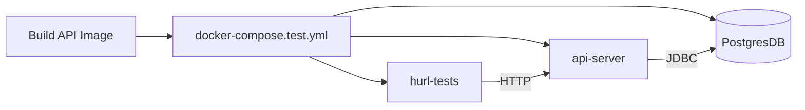

# Testing

> All testing strategies for the project in one place.

---

## Quick Start

```bash
npm run test:run         # Client unit/component tests (Vitest, all workspaces)
npm run test:api         # API E2E tests (Hurl, against local Spring Boot on :8081)

npm run test:api:clean   # Tear down the API test harness after testing
```

---

## 1. Client Unit Tests (Vitest)

### What to Test

```
core/    → test everything. Pure logic, zero deps. Highest value.
editor/  → test commands and cursor transitions against real Document.
view/    → test viewport math against a stubbed IEditorState.
ui/      → do NOT unit test. React components are integration territory.
```

### Test File Placement

Co-located with source — `foo.ts` → `foo.test.ts` in the same directory.

```
packages/client/src/
  core/
    document/document.test.ts, collaborativeDocument.test.ts
    position/position.test.ts, range.test.ts
    lines/lineIndex.test.ts
    utils.test.ts
  editor/
    cursor/cursor.test.ts
    editorState.test.ts, editorState.collab.test.ts
  view/viewModel.test.ts
  ui/utils.test.ts
  hooks/useSoloEditor.test.ts
  auth/tokenStorage.test.ts
```

### Configuration

Vitest reads `vite.config.ts` directly — path aliases (`@/*`) work in tests with zero extra config.

```bash
npm install -D vitest      # already installed
```

### Mocking Approach

- **Core layer**: no mocking needed — all pure value types.
- **Editor layer**: use the real `Document` class (no side effects).
- **View layer**: use a manual `IEditorState` stub (see `viewModel.test.ts`).

---

## 2. Sync Server Unit Tests (Vitest)

### What to Test

The sync-server is built on a modular EventBus architecture.
- **`modules/`**: Unit test individual services (`protocolHandler`, `permissionService`) by passing in a mock `EventBus` and asserting the correct events are emitted or handled.
- **`infra/`**: Test infrastructure wrappers (like `eventBus` or `redisEventBridge`) in isolation.

### Test File Placement

Co-located with source:
```
packages/sync-server/src/
  modules/
    permission/permissionService.test.ts
  infra/
    eventBus.test.ts
```

---

## 3. API Contract & E2E Testing (Hurl + Docker)

[Hurl](https://hurl.dev) scripts run full HTTP flows against the real Docker API image inside a hermetic Compose network.



### Stack & Infrastructure

- **No SpringBootTests for Controllers:** Coverage is owned entirely by `hurl` testing the real servlet layer running in Docker.
- **Hermetic Harness:** Tests run inside `docker-compose.test.yml` using `postgres:16`, the built `api-server` image, and the official `hurl` runner.

### File Placement

```
packages/api-server/hurl/
  auth.hurl                          ← per-resource tests
  room.hurl
  flow_basic_room_management.hurl    ← multi-step user journeys
```

### Running

```bash
npm run test:api         # Builds the local image and runs the test harness
npm run test:api:clean   # Tears down the test harness and database volume
```

### Conventions

- Interpolate `{{suffix}}` into test data (emails, names) for idempotent reruns.
- Flow scripts (`flow_*.hurl`) model end-to-end user journeys.
- Every new controller endpoint must be covered by a `.hurl` file handling Happy Path, Validation Failure, Auth Guard, and Domain Error.
